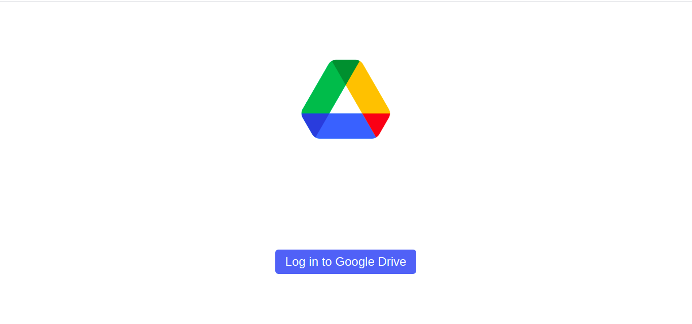
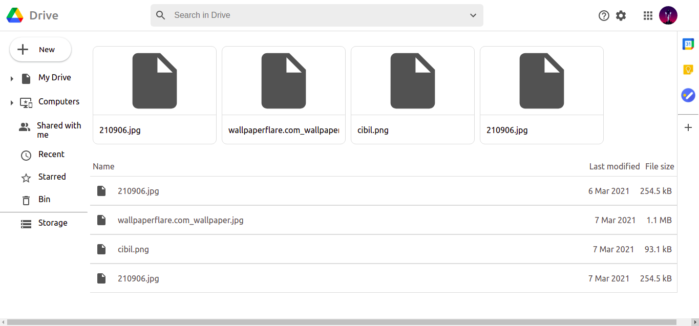

# google-drive-clone
Google Drive clone using ReactJS 

### Tools Used
- React JS
- firebase ( db, storage, Authentication)

## Installation

- Clone repo
 
    ```
    git clone https://github.com/akashghanate/  google-drive-clone.git
    ```
- Install Packages 
    ``` 
    yarn install 
    ```
- Run the App
    ```
    yarn start
    ```
## UI

### Login Screen
- Uses Google Provider login



### Main Screen

